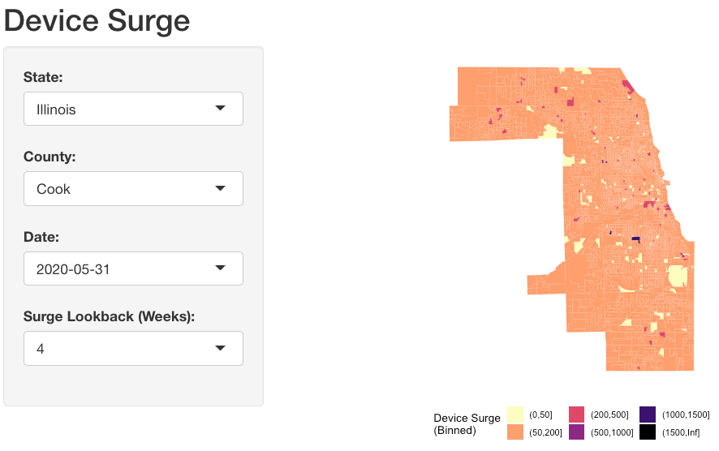

# Visualizing Device Surge During the George Floyd Protests

This repository contains a Shiny app that visualizes David van Dijcke and Austin Wright's ``device surge'' measure of protest activity. They describe the measure in [this working paper](https://papers.ssrn.com/sol3/papers.cfm?abstract_id=3621731), provide sample code that generates it in [this GitHub repo](https://github.com/Davidvandijcke/FLOYDTRACES_PUBLIC), and share the data [via Dropbox](https://www.dropbox.com/s/vv5qhq68dtsx9cu/floydDeviceTraces_public.csv.gz?dl=0).

This app's goal is to make it easier to explore device surge across place and time.




## Quick Start
Running the app requires (1) downloading census block group shapefiles from the US census, (2) launching the Shiny app from an R session. I recommend the following steps.

First, use the included utility script to download shapefiles for all states:
```
cd shapefiles
./download.sh
cd ..
```

Then, launch the R project `shiny-surge-floyd.Rproj` in RStudio and open the file `global.R` . From here, you can click "Run App" at the top of the screen, or execute the command `shiny::runApp()` in the R console. The app should launch in a few seconds.

Inside the app, pick a state, county, and date to generate a map of device surge. You can also toggle the reference period used to define device surge.


## Code
* global.R: loads libraries and data that power the Shiny app.
* ui.R: controls what the user sees when interacting with the app.
* server.R: responds to user input
* xx_compress_device_surge.R: a preprocessing script that subsets and compresses van Dijcke and Wright's device surge estimates, making it possible to post to GitHub.


## Data
* states.rds: a tibble containing the name and two-digit FIPS code for each US state.
* counties.rds: a tibble contain the name and three-digit FIPS code for each US county, as well as the name and two-digit FIPS code for the state it's in.
* device_surge.rds: a tibble adapted from van Dijcke and Wright's public dataset. Each row contains four measurements for device surge in the columns named outside_perc_{X}wk, which describe the number of devices that visited the census block group {geoid} on {date}, compared to the the daily average in the {X} weeks before May 26. 
